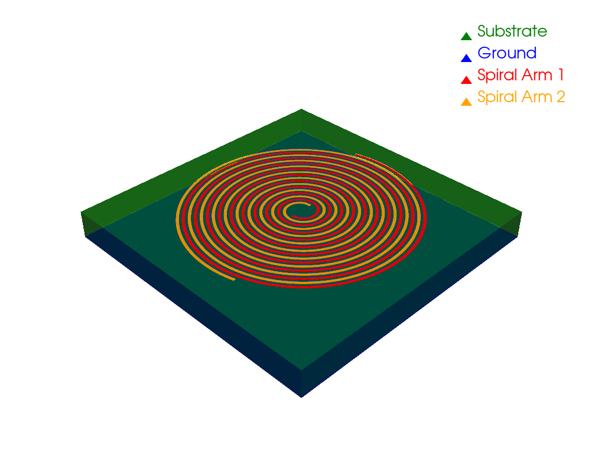

# Final year project

The goal of the project is to make a create a PCB archimedean spiral antenna used for intercept messages from the IRIDIUM satellite constellation to prove that satellites transmit messages to eachother to cover greater distances.



## Current state

- An example model of what the antenna should look like in the final state can be seen using :

```bash

pyhton3 test.py

```

in the pyvista folder.

- the code for the EM simulation is on progress. Some understanding difficulties are encounterd at this step due to the documentation.

## Tools used

### programming and modelisation

- pyvista : for 3D modeling
- openEMS : for EM simulation and testing

### hardware

- RaspberryPi
- rtlSDR
- PlutoSDR
- CNC  
