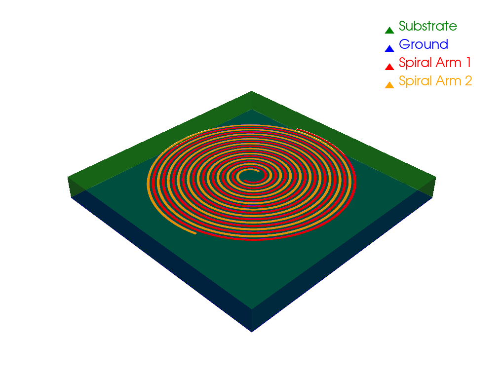
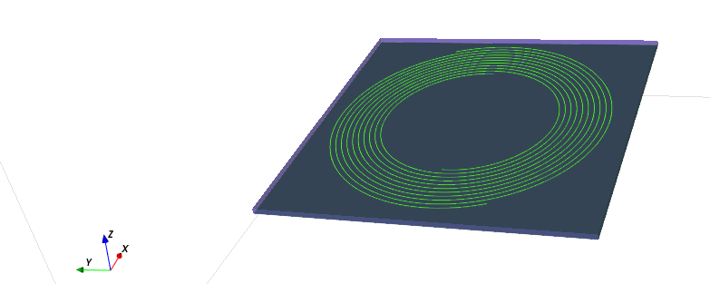
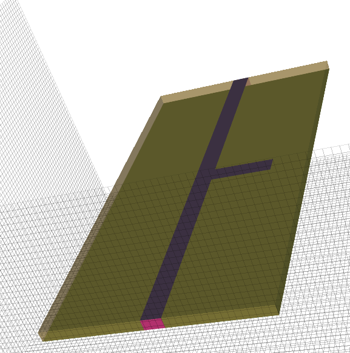
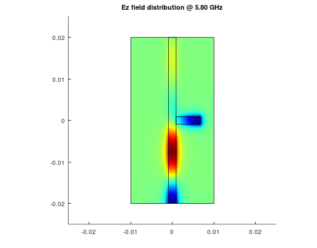
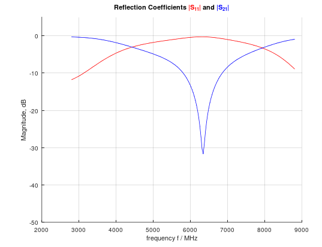

# Final year project

The goal of the project is to make a create a PCB archimedean spiral antenna used for intercept messages from the IRIDIUM satellite constellation to prove that satellites transmit messages to eachother to cover greater distances.



## Current state

### Work done

- An example model of what the antenna should look like in the final state can be seen in the pyvisa folder using :
- The projet has berrn redefined and the objective is to make simpler things before :

  - Creating and validating a simple line (status: goal)
  - Creating and validating a simple patch (status: goal)
  - Creating and validating a one arm spiral (status: goal)

```bash

pyhton3 spiral_antenna_pyvista.py

```

- The CAD using CSXCAD is done and can be seen in openEMS/simulation folder and run by using :

```bash

python3 spiral_patch.py

```

or

```bash

AppCSXCAD patch_antenna.xml 

```



### Results of the tutorial

Here are the result using the youtube tutorial at :
[Youtube tutorial](https://youtu.be/SPlrcp-gCKk?si=wbu3DHEVbzqxzVoI)





### Next step

Creating the line model.

## Tools used

### Programming and modelisation

- pyvista: for 3D modeling
- openEMS + CSXCAD: for EM simulation and testing
- octave: to run openEMS and CSXCAD

### Hardware

- RaspberryPi
- rtlSDR
- PlutoSDR
- CNC  
